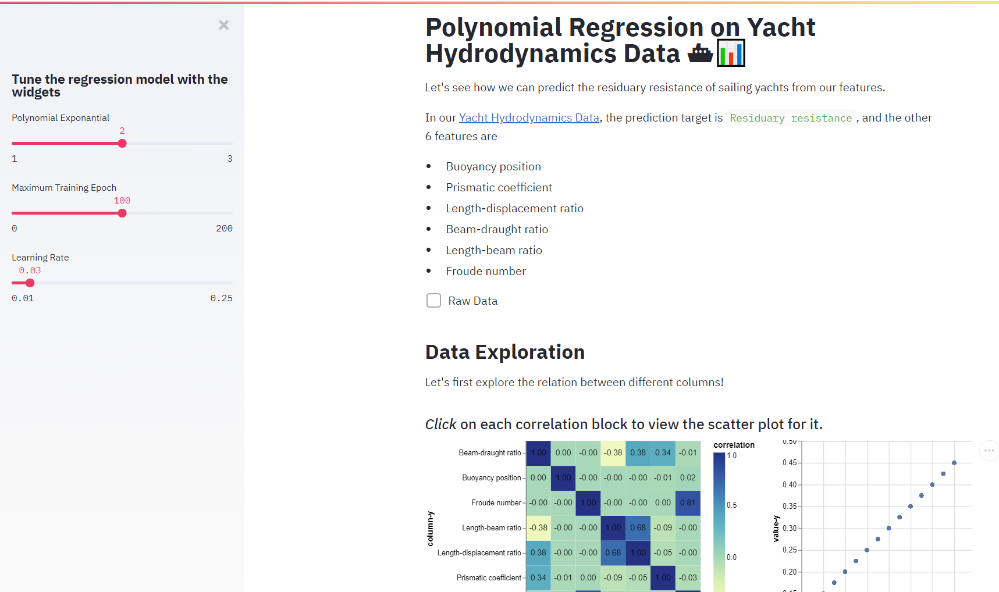

# Let's analyze some Yacht Data

TODO: Short abstract describing the main goals and how you achieved them.

## Project Goals

Question: how to build a machine learning model on [Yacht dataset](https://archive.ics.uci.edu/ml/datasets/Yacht+Hydrodynamics) to predict the residuary resistance per unit weight of displacement?

Our goal in this assignment is to present the machine learning process interactively. Machine learning is a powerful tool to build predictive models. For example, in the Yacht dataset, we can use linear regression to predict the residuary resistance per unit weight of displacement. However, the process to build a machine learning model is hard to documented and presented because:

* We cannot estimate the quality of features, learning rates, training epochs, and other parameters without experiments, therefore the process of building a machine learning model is interactive.
* The common optimization algorithms such as Stochastic Gradient Descent are iterative, so the learning process itself contains new data, which are in the time-series format, and dynamically constructed from the dataset.

Therefore, it is compelling to visualize both the original dataset and the new data from the learning process in an interactive way. Our solution is to create an interactive playground to present them, so users can get a better understanding about the process of building predictive models through exploring our UI.

## Design

To achieve the goal, we use Streamlit to build a simple yet comprehensive application for visualizing the machine learning process on the Yacht dataset. We first perform some exploratory visualization through the Altair API. We visualize the correlation matrix between different columns of the data, so users exploring our UI can have an idea about the relationship between different features, and between target and features. We can see that there is a strong correlation between residuary resistance and froude number. Users can further explore whether other dimensions can influence the relationship between residuary resistance and froude number. We then build an interactive panel to show the prediction of residuary resistance based on all the features we have. Users can play with the learning rate and epoch to understand the behavior of the models. During exploratory visualization, users may find that although residuary resistance has a strong correlation with froude number, their relation is not linear but rather polynomial. In our panel, users can experiment with the feature engineering part and understand how feature engineering impacts the performance of our models on the Yacht dataset.

Interactions are present in both steps to help users actively acquire insights from data. In the exploratory visualization step, variable selection and coordination techniques are leveraged. In the machine learning step, our app brings some visualizations for the time-series training status of machine learning (highlight and tooltip), and even some Streamlit widgets for users to manually tune the model based on the visual effects. Users can perform various analyses based on our app to understand the choice of features and hyperparameters.

## Development

TODO: **An overview of your development process.** Describe how the work was split among the team members. Include a commentary on the development process, including answers to the following questions: Roughly how much time did you spend developing your application (in people-hours)? What aspects took the most time?
